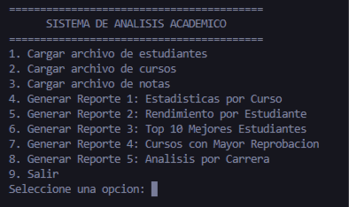
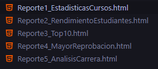

# Manual de Usuario
**Práctica 1: Sistema de Análisis Académico**

## 1. Introducción
Bienvenido al Sistema de Análisis Académico. Esta herramienta de consola te permite cargar información de estudiantes, cursos y notas a partir de archivos de texto (`.lfp`) para generar reportes estadísticos y analíticos detallados en formato HTML.

## 2. Requisitos Previos
Para utilizar este sistema, asegúrate de tener:
* El archivo ejecutable compilado (ej. `main.exe` en Windows o `./main` en Linux/Mac).
* Los archivos de datos `.lfp` (Estudiantes, Cursos y Notas) ubicados preferiblemente en la misma carpeta que el ejecutable.

## 3. Guía de Uso Paso a Paso

### Paso 1: Iniciar el Sistema
Abre tu terminal (PowerShell, CMD o la terminal de VS Code), navega hasta la carpeta del proyecto y ejecuta el programa escribiendo:
`.\main.exe`
*(En Linux/Mac usa `./main`)*

Verás el Menú Principal con 9 opciones disponibles.
 

### Paso 2: Cargar los Archivos de Datos
Antes de generar cualquier reporte, debes cargar la información al sistema. 
1. Escribe el número **1** y presiona Enter para cargar estudiantes. El sistema te pedirá la ruta del archivo. Escribe el nombre de tu archivo (ej. `estudiantes.lfp`) y presiona Enter.
2. Repite el proceso con la opción **2** para los cursos (ej. `cursos.lfp`).
3. Repite el proceso con la opción **3** para las notas (ej. `notas.lfp`).

El sistema te confirmará si los archivos se cargaron exitosamente.

### Paso 3: Generar Reportes
Una vez cargados los datos, puedes seleccionar las opciones del **4 al 8** para generar los distintos reportes. 
* **Opción 4:** Genera el Reporte 1 (Estadísticas Generales por Curso).
* **Opción 5:** Genera el Reporte 2 (Rendimiento por Estudiante).
* **Opción 6:** Genera el Reporte 3 (Top 10 Mejores Estudiantes).
* **Opción 7:** Genera el Reporte 4 (Cursos con Mayor Reprobación).
* **Opción 8:** Genera el Reporte 5 (Análisis por Carrera).

Al seleccionar una opción, el sistema procesará los datos en silencio y creará un archivo `.html` en la misma carpeta.

### Paso 4: Visualizar los Resultados
Ve a la carpeta de tu proyecto desde el explorador de archivos de tu computadora. Verás que se han creado archivos web (HTML) con los nombres de los reportes. Haz doble clic en cualquiera de ellos para abrirlo en tu navegador web (Chrome, Edge, Firefox, etc.) y visualizar las tablas generadas.

### Paso 5: Salir del Sistema
Para cerrar el programa de forma segura, simplemente selecciona la opción **9** en el menú principal y presiona Enter.