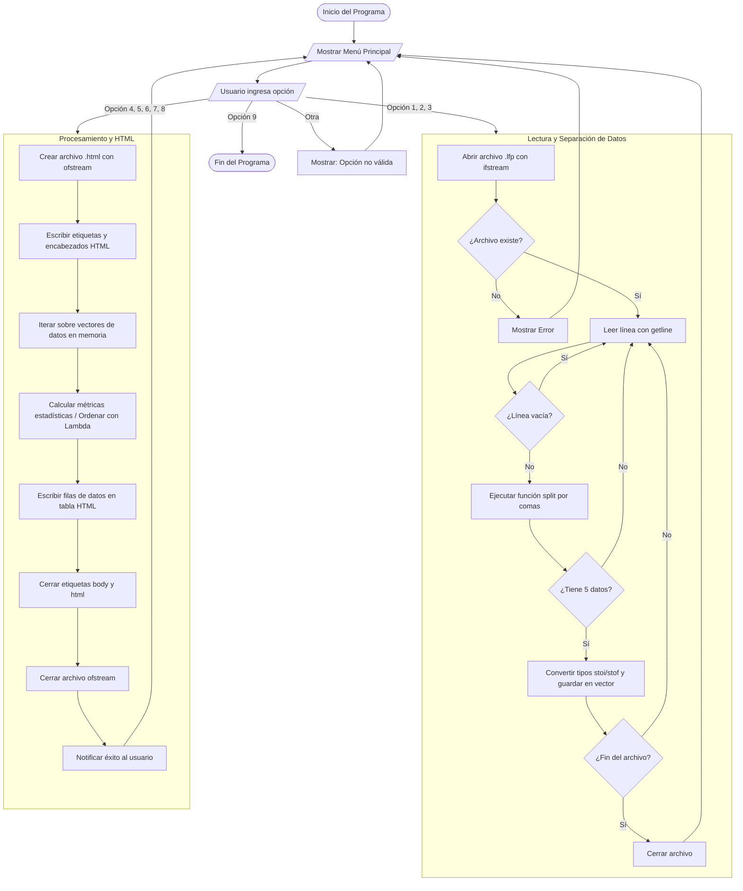

# Práctica 1 - Sistema de Análisis Académico
**Curso:** Lenguajes Formales y de Programación
**Semestre:** 1S 2026

## Descripción del Proyecto
Este repositorio contiene el código fuente y la documentación de la Práctica 1. El proyecto es una aplicación de consola desarrollada en C++ que permite la lectura de archivos de texto plano (`.lfp`) con información académica (Estudiantes, Cursos y Notas). El sistema procesa estos datos dinámicamente en memoria y genera reportes estadísticos exportados automáticamente en formato HTML.

## ⚙️ Instrucciones de Ejecución
El proyecto está diseñado para compilarse y ejecutarse a través de la consola del sistema operativo (PowerShell, CMD, o terminal de MSYS2/Linux).

### Paso 1: Compilación
Abre una terminal, navega hasta la carpeta `Practica1` y ejecuta el compilador `g++`:
```bash
g++ main.cpp -o main.exe
```
*(Nota: Si usas Linux o Mac, el comando de salida puede ser `-o main` sin la extensión .exe).*

### Paso 2: Ejecución
Una vez generado el archivo ejecutable, lánzalo con el siguiente comando:
```bash
.\main.exe
```
*(En Linux/Mac utiliza `./main`)*

## 🚀 Ejemplos de Uso
Al iniciar el programa, se desplegará un menú interactivo del 1 al 9.

**1. Carga de datos:**
Para que el sistema funcione, primero debes cargar los archivos. Selecciona la opción `1` y escribe la ruta del archivo cuando el sistema lo solicite:
> `Seleccione una opcion: 1`
> `Ruta del archivo de estudiantes: estudiantes.lfp`

*(Repite este proceso con las opciones 2 y 3 para los cursos y las notas).*

**2. Generación de Reportes:**
Una vez cargados los tres archivos, selecciona cualquier opción del `4` al `8`. 
Por ejemplo, para ver a los mejores alumnos:
> `Seleccione una opcion: 6`
> `Generando Reporte 3: Top 10 Mejores Estudiantes...`

El sistema creará inmediatamente un archivo llamado `Reporte3_Top10.html` en la misma carpeta del proyecto. Ábrelo en cualquier navegador web para ver los resultados.

## Documentación
Dentro de la carpeta `Practica1` podrás encontrar la documentación detallada del proyecto:
* `Manual_Tecnico.md`: Arquitectura, estructuras de datos y lógica de parseo.
* `Manual_Usuario.md`: Guía paso a paso con capturas de pantalla del uso del sistema.
* `Informe_Desarrollo.md`: Retos técnicos, soluciones aplicadas y conclusiones.


